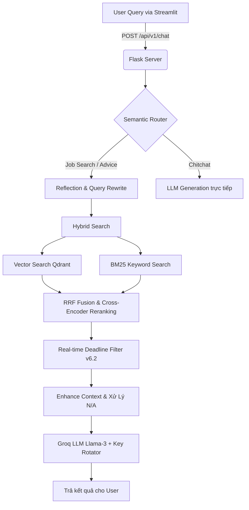

# 🤖 Career Bot v6.2: AI Career Assistant & Job Recommender

Hệ thống **Career Bot v6.2** là một giải pháp AI hoàn chỉnh, sử dụng kiến trúc **RAG (Retrieval-Augmented Generation)** để cung cấp dịch vụ tìm kiếm việc làm thông minh và tư vấn nghề nghiệp cho thị trường lao động Việt Nam. Dự án tập trung vào tính chính xác, tốc độ, tối ưu tài nguyên CPU và phân tích dữ liệu thực tế siêu mượt mà.

---

## 🎯 1. Các Tính Năng Đột Phá Tại v6.2

- **⚡ API Key Rotation (Siêu bền bỉ):**
    - Hỗ trợ lưu trữ nhiều API Key cùng lúc thông qua `GROQ_API_KEYS`. Tự động xoay vòng sang Key dự phòng ngay lập tức khi gặp lỗi `429 Rate Limit`. Tích hợp logic xử lý `Retry-After` thông minh mà không làm sập tiến trình.
- **🔍 Truy Xuất 10 Kết Quả (Hybrid Search Mở Rộng):**
    - Hệ thống được nới lỏng giới hạn mặc định (`DEFAULT_SEARCH_LIMIT=10`), sẵn sàng tìm và trả về top 10 công việc sát nhất với yêu cầu người dùng thay vì 3 như phiên bản cũ.
- **🚀 Reranker CPU-Optimized (BGE/mMARCO):**
    - Hỗ trợ và tối ưu trơn tru cho nhữg mô hình Xếp hạng siêu nhẹ để chạy thực tế trên cấu hình không GPU: `BAAI/bge-reranker-v2-m3` hoặc `cross-encoder/mmarco-mMiniLMv2-L12-H384-v1`. Nhanh hơn 300% so với bản gốc Jina-v3.
- **💬 Tư Vấn Đỉnh Cao & Định Danh Rõ Ràng (Identity Anti-AI):**
    - Luật System Prompt được bọc rào chống "ảo giác" (Hallucination) triệt để: Bot bắt buộc xưng **"Mình"** và gọi **"Bạn"**. 
    - Tuyệt đối nghiêm cấm các văn mẫu cứng nhắc như *"Tôi có thể giúp bạn..."*, *"Lý do 1, Lý do 2..."* hoặc *"Tôi xin lỗi..."*. Trả lời mượt mà, sâu sắc như một CV Consultant thực thụ.
- **🛡️ Data Normalizing (Dọn rác Qdrant N/A):** 
    - Tiền xử lý RAG chặn mọi field `"N/A"`, tự động hiển thị `"Xem chi tiết công việc tại link đính kèm"` để gỡ rối cho LLM.
- **⏰ Ổn định Bộ Lọc Deadline:** Sử dụng Sentinel Value chuẩn `9999999999.0` để kiểm soát các bản ghi không có ngày hết hạn, tránh xóa nhầm trong pipeline cronjob.

---

## 🏗️ 2. Kiến Trúc Hệ Thống (Architecture)



---

## 📂 3. Cấu Trúc Thư Mục (Folder Structure)

```text
restar/
├── demo_app.py                   # 🎨 Giao diện Streamlit (Frontend).
├── flask_serve.py                # ⚙️ Backend API Server (Flask): Điều phối logic, chứa bộ Prompts siêu Việt hoá.
├── hf_client.py                  # 📡 LLM Client tích hợp cơ chế Retry & Key Rotation.
├── pipeline/
│   └── deadline_cleaner.py       # 🧹 Worker tự động dọn dẹp Job hết hạn (Hỗ trợ Cron / Scheduler).
├── data/                         
│   ├── intents.json              # Mẫu phân loại Intent siêu tốc cho Semantic Router.
│   └── bm25_cache.pkl            # Cache Engine cho BM25 (Tăng tốc khởi động).
├── embedding_model/              
│   └── core.py                   # 🧠 Quản lý mô hình nhúng (Cấu hình song song RAM).
├── rag/
│   └── core.py                   # 🔍 RAG Engine (Hybrid Search, CPU Reranking, Chuẩn hoá Data Rỗng).
├── reflection/
│   └── core.py                   # 🔁 In-Memory Context & Query Transformation (Cache RAM thay vì DB).
├── semantic_router/
│   └── router.py                 # 🚥 Bộ phân luồng hội thoại phân tích sắc bén với 100 Sample Limit.
└── qrantdtbs (2).ipynb           # Kịch bản Ingest + Preprocess Text dữ liệu TopCV đưa lên Qdrant Cloud.
```

---

## 🛠️ 4. Hướng Dẫn Cài Đặt

### Bước 1: Môi trường
- Python >= 3.10
- Khởi tạo thư viện: `pip install -r requirements.txt`

### Bước 2: Biến môi trường (.env)
Tạo file `.env` theo định dạng sau:
```env
# Nhập nhiều Key phân cách bằng dấu phẩy để hệ thống xoay vòng chống 429 Limit
GROQ_API_KEYS=gsk_key1xxxxxxxxxxxx,gsk_key2xxxxxxxxxxxx
GROQ_MODEL=llama-3.1-8b-instant

QDRANT_URL=https://<your-cluster>.qdrant.io:6333
QDRANT_API_KEY=your_qdrant_api_key_here
QDRANT_COLLECTION=topcv_jobs_v3

# Hỗ trợ Reranker siêu nhẹ cho CPU
CROSS_ENCODER_MODEL=BAAI/bge-reranker-v2-m3
# CROSS_ENCODER_MODEL=cross-encoder/mmarco-mMiniLMv2-L12-H384-v1

DEFAULT_SEARCH_LIMIT=10
SIMILARITY_THRESHOLD=0.25
RERANK_TOP_K=15
FLASK_PORT=5001
```

### Bước 3: Khởi chạy
1. Mở Terminal 1 (Chạy Backend): `python flask_serve.py`
2. Mở Terminal 2 (Chạy Giao diện UI): `streamlit run demo_app.py`

---

## 🔌 5. Đặc Tả API Endpoints

- `GET /api/v1/health`: Kiểm tra sức khỏe kết nối DB, Embedding load status.
- `POST /api/v1/chat`: Endpoint giao tiếp cốt lõi. Bơm context từ UI vào LLM.
    - *Body*: `{"query": "data analyst hcm", "session_id": "user_123"}`

---
_Lưu ý: Mọi tinh chỉnh từ Data Filtering, Key Rotation đến Giọng điệu của Bot ở v6.2 đều được căn chỉnh tỉ mỉ tại mức Source Code nhằm loại bỏ tư duy phản hồi khuôn mẫu (Robotic AI), hướng đến trải nghiệm như một chuyên gia IT Headhunter đích thực._
