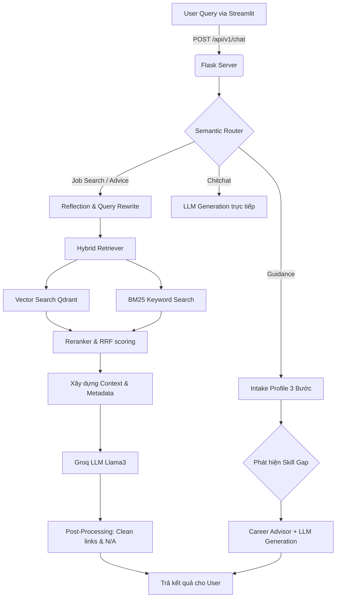

# 🤖 Career Bot v6: AI Career Assistant & Job Recommender

Hệ thống **Career Bot v6** là một giải pháp AI hoàn chỉnh, sử dụng kiến trúc **RAG (Retrieval-Augmented Generation)** để cung cấp dịch vụ tìm kiếm việc làm thông minh và định hướng nghề nghiệp chuyên sâu cho thị trường lao động Việt Nam. Dữ liệu được tối ưu dựa trên nền tảng **TopCV**.

Dự án này đã tiến hóa đến phiên bản v6, tích hợp những thuật toán truy xuất lai (Hybrid Search) hiện đại, bộ máy Định tuyến ngữ nghĩa (Semantic Router) siêu tốc, và cơ chế cá nhân hóa lộ trình phát triển (Guidance) thông minh giúp sinh viên và người mới ra trường dễ dàng tìm được công việc chân ái.

---

## 🎯 1. Các Tính Năng Nổi Bật (Core Features)

- **🔍 Tìm Kiếm Việc Làm Thông Minh (Job Search):** Truy xuất việc làm theo ngữ nghĩa (Semantic Search), hỗ trợ phân tách địa điểm, mức lương, và mức kinh nghiệm (Fresher/Junior/Senior). Hỗ trợ Hybrid Search kết hợp BM25 và Vector Search với RRF, sau đó xếp hạng lại qua mô hình Cross-encoder Reranker.
- **🧭 Tư Vấn Định Hướng Cá Nhân Hóa (Career Guidance):** Hệ thống có cơ chế "Intake Profile" 3 bước (Hỏi Ngành học ➔ Kỹ năng hiện có ➔ Vị trí mục tiêu). Phân tích lỗ hổng kỹ năng (Skill Gap Analysis) dựa trên dữ liệu thị trường và cung cấp lộ trình học tập 6 tháng tiếp theo.
- **📊 Góc Nhìn Thị Trường (Market Insights):** Cung cấp lời khuyên nghề nghiệp (Career Advice) dựa trên tần suất từ khóa kỹ năng từ nhà tuyển dụng thực tế (giúp user nhận biết tech stack nào đang "hot").
- **💬 Trò Chuyện Tự Nhiên (Chit-chat):** Hệ thống được định tuyến bằng Semantic Router để rẽ qua nhánh phản hồi nhanh nếu người dùng chỉ giao tiếp thông thường, không lạm dụng RAG gây tốn kém token/phản hồi chậm.
- **🧠 Quản Lý Trí Nhớ & Suy Ngẫm (Memory & Reflection):** Bot lưu trữ lịch sử hội thoại có TTL (2 hours decay) và có kỹ năng tự viết lại câu hỏi (Query Rewriting) dựa vào ngữ cảnh cũ, cho phép người dùng hỏi tiếp nối (VD: _"Tìm việc IT ở HN"_, rồi hỏi tiếp _"Lương trên 20 triệu thì sao?"_).
- **🛡️ Xử Lý Lỗi Dữ Liệu & Ảo Giác (Anti-Hallucination):** Tự động phát hiện và loại bỏ các dữ liệu rỗng (như thông tin doanh nghiệp là "N/A"), loại trừ việc LLM tự bịa ra tên công ty giả, loại bỏ các Markdown heading rác.

---

## 🏗️ 2. Kiến Trúc Luồng Dữ Liệu (Data Pipeline & Architecture)

Hệ thống được chia là 2 giai đoạn (Phases) chạy độc lập:

### Phase 1: Ingestion Pipeline (Xử lý & Nhúng Vector)
1. **Thu thập dữ liệu (Crawling):** Script Selenium thu thập thông tin Job Posting từ TopCV (Title, Company, Salary, JD, Requirements, Benefits).
2. **Tiền xử lý (Preprocessing):** Làm sạch HTML, chuẩn hóa lương, gộp dữ liệu thành chuỗi văn bản sạch.
3. **Nhúng Vector (Embedding):** Dùng mô hình nhúng (VD: `Jina-v3`) chạy trên môi trường có GPU (Kaggle) để biến đổi đoạn text thành các vector nhiều chiều (1024-dim).
4. **Vector Database:** Lưu vector, metadata (salary_max, location_norm, v.v.), và dữ liệu chunking lên **Qdrant Cloud/Local**. Đồng bộ hóa `skill_taxonomy.json` tự động trích xuất các keyword công nghệ.

### Phase 2: Inference Framework (API / Web App)


---

## 📂 3. Ý Nghĩa Cấu Trúc Thư Mục

```text
career_bot_v6/
├── demo_app.py                   # 🎨 Giao diện Streamlit: Frontend thân thiện tương tác trực tiếp với API chat.
├── flask_serve.py                # ⚙️ Trái tim của Backend: Flask Server xử lý Routing, Session State và expose APIs.
├── hf_client.py                  # 📡 LLM HTTP Client: Gọi API Groq/HuggingFace với cơ chế tự động Retry thông minh khi gặp lỗi rate limit (429) hoặc 5xx.
├── README.md                     # 📖 Tài liệu kỹ thuật.
├── requirements.txt              # 📦 Dependencies thiết lập môi trường.
│
├── career_guidance/              # 🎯 Module Chuyên Môn Định Hướng Nghề Nghiệp:
│   ├── advisor.py                # Chứa logic tổng hợp, tạo prompt xin lời khuyên định hướng cá nhân hóa.
│   ├── market_analyzer.py        # Đánh giá thị trường, độ phủ (coverage) của bộ skill users so với JD thực tế.
│   └── skill_extractor.py        # Nhận diện, bóc tách Entity (tên công nghệ, kỹ năng) từ input người dùng.
│
├── data/                         # 🗃️ Cấu hình tinh chỉnh nội bộ:
│   ├── intents.json              # Các mẫu câu mẫu (anchors) phục vụ Semantic Router map embeddings.
│   ├── vn_stopwords.txt          # Danh sách từ dừng Tiếng Việt hỗ trợ search keyword BM25.
│   └── skill_taxonomy.json       # Phân cụm và số liệu thống kê công nghệ để làm insight (Market Data).
│
├── embedding_model/              
│   └── core.py                   # 🧠 Quản lý mô hình nhúng (SentenceTransformers/Jina) cho việc nhúng truy vấn thời gian thực.
│
├── rag/
│   └── core.py                   # 🔍 RAG Engine: Trình xử lý truy xuất tài liệu tinh vi lai dắt Hybrid(BM25 + Qdrant), xử lý filters (lương, kinh nghiệm, địa điểm) dọn dẹp các keyword "N/A" công ty đi.
│
├── reflection/
│   └── core.py                   # 🔁 Bộ nhớ Context: Lưu các đoạn hội thoại vào Qdrant và chịu trách nhiệm LLM suy nghĩ viết lại truy vấn người dùng (Query Transformation).
│
├── scripts/                      
│   ├── crawl.py                  # Công cụ cào dữ liệu thô bổ sung.
│   └── kaggle_ingest.py          # Script độc lập dùng trên Kaggle GPU để Vectorize toàn bộ kho dữ liệu.
│
└── semantic_router/
    └── router.py                 # 🚥 Mạng lưới AI siêu tốc phân luồng hội thoại không dùng LLM (Cos Similary vs Intents).
```

---

## 🛠️ 4. Hướng Dẫn Cài Đặt (Local Environment)

### Yêu Cầu Cấu Hình
- Python >= 3.10
- Khuyến nghị sử dụng [Conda](https://docs.conda.io/en/latest/) hoặc `venv` đê tạo không gian ảo độc lập.

### Bước 1: Clone & Cài Đặt Thư Viện

```bash
# Di chuyển tới dự án 
cd career_bot_v6

# Cài đặt file requirements (.txt)
pip install -r requirements.txt
```

### Bước 2: Thiết lập biến môi trường
Tạo một file có tên là `.env` tại thư mục gốc, copy và thay thế tham số tương ứng của bạn:

```env
# GROQ_API_KEY có thể lấy miễn phí qua: https://console.groq.com/keys
GROQ_API_KEY=gsk_your_key_here
GROQ_MODEL=llama-3.1-8b-instant

# Cấu hình Vector DB (Local Memory hoặc Cloud)
QDRANT_URL=https://<your-cluster>.qdrant.io:6333
QDRANT_API_KEY=your_qdrant_api_key_here
QDRANT_COLLECTION=topcv_jobs_v3

# Config hệ thống Backend khác
GROQ_TIMEOUT=60
FLASK_PORT=5001
```

### Bước 3: Khởi chạy Ứng Dụng

Vì Career Bot v6 chạy dưới dạng microservice nên bạn cần 2 Terminal riêng biệt.

**Terminal 1 (Backend Flask API):**
Bật server nội bộ chứa bộ máy AI tính toán RAG, DB kết xuất.
```bash
python flask_serve.py
```
> Server sẽ hiển thị _Starting Career Bot v6 on port 5001..._ kèm thời gian Pipeline Initializing.

**Terminal 2 (Frontend Streamlit):**
Giao diện hiển thị trực quan (Chat Interface) phía người dùng.
```bash
streamlit run demo_app.py
```
> Trình duyệt web sẽ tự động mở lên tại `http://localhost:8501`.

---

## 🔌 5. Đặc Tả REST API Endpoints (Dành cho Dev)

Bạn cũng có thể gọi thẳng Server thông qua Postman hoặc phần mềm ngoài nếu không thích dùng Streamlit, base `http://127.0.0.1:5001`.

- `GET /api/v1/health`
  - **Mục đích**: Kiểm tra tình trạng sức khỏe kết nối DB, collection RAG, model Embedding.
- `POST /api/v1/chat`
  - **Body Format**: `{"query": "tìm việc php ở q1", "session_id": "user_local01"}`
  - **Mục đích**: Đầu mối chính cho chức năng Tìm việc, Chit-chat, Xin tư vấn. Pipeline sẽ tự định tuyến truy vấn tiếp theo. Trả về format đẹp, đã làm sạch link giả và chặn markdown rác.
- `POST /api/v1/career_guidance`
  - **Body Format**: `{"query": "Frontend Dev", "session_id": "user_local01"}`
  - **Mục đích**: Xử lý intake 3 vòng (chuyên môn, vị trí, tech stack). Đóng băng session profile hiện tại của User và theo dõi Gap.
- `GET /api/v1/skills`
  - **Params**: `?field=backend&n=15` (Chỉ lấy mảng backend, tối đa 15 skills).
  - **Mục đích**: Fetch phân tích thống kê Top skill từ database `Skill Taxonomy` đã tính toán trước thị trường.
- `POST /api/v1/reset_guidance`
  - **Body Format**: `{"session_id": "user_local01"}`
  - **Mục đích**: Xoá luồng Context cũ, khởi động lại định vị chuyên môn cho user trong Career Guidance.

---

## 🚀 6. Change Logs Đột Phá Tại v6 (So với v5)

1. **Khử Ảo Giác "N/A" (Anti-Hallucination):** 
   - Thay vì để LLM trả ra "Công ty: N/A" khi dữ liệu crawl bị thiếu thông tin cty, v6 **triệt để xoá dòng công ty** trong format hiển thị cuối thông qua kỹ thuật prompt control nghiêm ngặt và post-processing hàm lượng cao. Bot thể hiện sự chuyên nghiệp khi loại bỏ các thuộc tính vô vi bằng string rỗng.
2. **Quy Đổi Lương Hệ Triệu Lọc Siêu Nhanh ([V6-2])**: 
   - Thay vì vướng bận parse VNĐ phức tạp, query regex nội bộ nhận diện format text như _"trên 20 củ", "20 triệu"_ thành bộ lọc logic `min=20`. Rất có lợi trong việc tăng hiệu suất Vector Database Threshold Querying. Giữ tính năng session context giúp nâng mức lương lên +10% ở lần query tiếp khi user than "lương bèo quá!".
3. **Session Cache Cleanup [Memory Save]**:
   - Khởi tạo thread Daemon Garbage Collector trong `flask_serve.py`. Các context người dùng chưa active sau 2 giờ bị loại bỏ (`_CTX_TTL`).
4. **Intake Guidance Độc Lập Hoàn Hảo**:
   - Vách ngăn giữa Chit-Chat RAG và Profiling: Quá trình phân tích chuyên môn (Guidance) chia thành 3 step bắt buộc không gây mất phương hướng cho LLM. Covergae (Mật độ phù hợp với yêu cầu JD nhà tuyển dụng) được ước tính bằng Metric phần trăm chi tiết.

---
_Mọi đóng góp nhằm hoàn thiện Career Bot V6 xin vui lòng tạo Pull Request vào Repo này!_
